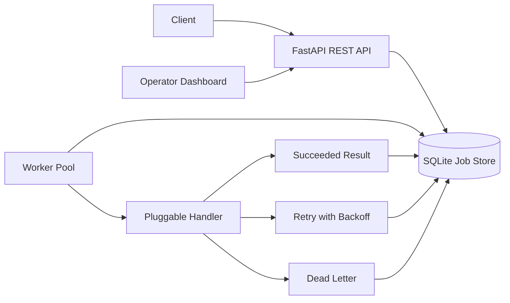

# PulseQueue

PulseQueue is a production-minded async job processing REST API built for the DigitalOcean product quality interview prompt. It accepts jobs over HTTP, persists them, processes them asynchronously with configurable retries and per-attempt timeouts, exposes lifecycle visibility, and includes an operator dashboard for load testing and runtime controls.

## Features

- REST API for job submission and status/result lookup.
- SQLite-backed durable job store for local development and interview demo.
- Worker pool with priority-based claiming, exponential backoff, timeout handling, and dead-lettering.
- Queue operations for depth, cancel, drain, and dead-letter inspection.
- Structured metrics for queue depth, worker utilization, job latency p50/p95, and dead-letter rate.
- Built-in operator dashboard at `/dashboard` with load test controls and runtime configuration.
- GitHub Actions CI that runs the full test suite.
- Dockerfile and Docker Compose for API/worker process separation.

## Architecture



## Local Setup

```bash
python3 -m venv .venv
source .venv/bin/activate
python -m pip install --upgrade pip
python -m pip install -e ".[dev]"
cp .env.example .env
```

Run the API:

```bash
uvicorn app.main:app --reload
```

Open:

- API docs: http://127.0.0.1:8000/docs
- Dashboard: http://127.0.0.1:8000/dashboard
- Health: http://127.0.0.1:8000/health

Run a separate worker process:

```bash
python -m app.worker
```

The API process starts an in-process worker pool by default for a smoother local demo. Set `AUTO_START_WORKER=false` when running a separate worker service, as shown in Docker Compose.

## Docker

```bash
docker compose up --build
```

Scale workers locally:

```bash
docker compose up --scale worker=3
```

## API Examples

Submit a job:

```bash
curl -s -X POST http://127.0.0.1:8000/jobs \
  -H "Content-Type: application/json" \
  -d '{"payload":{"action":"echo","message":"hello"},"priority":5,"max_retries":3,"timeout_seconds":5}'
```

Check queue depth:

```bash
curl -s http://127.0.0.1:8000/queue/depth | jq
```

Create load:

```bash
curl -s -X POST http://127.0.0.1:8000/load-test \
  -H "Content-Type: application/json" \
  -d '{"count":500,"kind":"mixed"}' | jq
```

Load test kinds:

- `echo`: all jobs succeed quickly.
- `flaky`: each job fails once, retries, then succeeds.
- `poison`: jobs fail until retry exhaustion and move to dead-letter.
- `timeout`: jobs sleep long enough to exercise timeout behavior when timeout is configured low.
- `mixed`: combines successful, flaky, timeout, and poison jobs for dashboard demos.

## Configuration

Global defaults come from environment variables:

- `DATABASE_PATH`
- `DEFAULT_MAX_RETRIES`
- `DEFAULT_TIMEOUT_SECONDS`
- `MAX_TIMEOUT_SECONDS`
- `WORKER_CONCURRENCY`
- `BACKOFF_BASE_SECONDS`
- `BACKOFF_MAX_SECONDS`
- `WORKER_POLL_INTERVAL_SECONDS`
- `AUTO_START_WORKER`

Each job can override `max_retries` and `timeout_seconds` in `POST /jobs`. The API validates those values and persists the effective settings on the job record, so worker restarts do not change job semantics.

`AUTO_START_WORKER=true` starts a worker pool inside the API process. Use this for the single-container DigitalOcean demo. Set `AUTO_START_WORKER=false` when API and worker are deployed as separate components, then run the worker with `python -m app.worker`.

Runtime configuration is available through:

- `GET /config`
- `PATCH /config`

The dashboard uses these endpoints to adjust retries, timeout, and local worker concurrency.

## Testing

```bash
pytest -q
```

## At-Least-Once Semantics

PulseQueue persists each accepted job before returning `202 Accepted`, then workers atomically claim due queued jobs from SQLite. This provides best-effort at-least-once delivery for the local demo.

It does not claim exactly-once execution. If a worker crashes after the handler performs an external side effect but before the result is persisted, a production lease reaper could make the job eligible for retry. Handlers should use `job_id` as an idempotency key for external systems.

Duplicate execution is bounded by `attempt_count`, `max_retries`, and the attempt log. Jobs that exceed retry limits are moved to the dead-letter store instead of disappearing silently.

## High Load Handling

The API and worker tiers are separable. Locally, Docker Compose can scale workers with `--scale worker=N`. On DigitalOcean App Platform, the API service and worker component should be deployed as separate components so worker capacity can scale independently.

Important high-load controls:

- Limit payload size and validate job parameters.
- Track queue depth and oldest queued age.
- Increase worker concurrency or worker containers when queue depth grows.
- Use dead-letter rate and p95 latency as operational signals.
- Move from SQLite to Postgres plus Redis/RabbitMQ/SQS for production multi-node workloads.

## Observability and Dashboard

The MVP exposes structured application metrics at `/metrics` and a built-in dashboard at `/dashboard`.

Dashboard demo flow:

1. Open `/dashboard`.
2. Submit a mixed load test.
3. Watch queue depth, worker utilization, latency, and dead-letter rate update.
4. Increase worker concurrency from the dashboard.
5. Observe the queue drain faster.

DigitalOcean provides infrastructure-level insights, alerts, logs, and uptime checks. PulseQueue adds queue-specific metrics that DigitalOcean does not infer automatically. A production next step would expose Prometheus-format metrics or OpenTelemetry and connect those to Grafana only when custom dashboards and alerts are needed.

## DigitalOcean Deployment Notes

Deployment typically needs:

- `DIGITALOCEAN_ACCESS_TOKEN` for `doctl` or GitHub Actions deployment.
- GitHub repository access for App Platform.
- Optional container registry credentials.
- A production `DATABASE_URL` if replacing SQLite with Managed Postgres.

If credentials are not available during the interview, the codebase still demonstrates the deployment shape through Docker and clear component separation.
