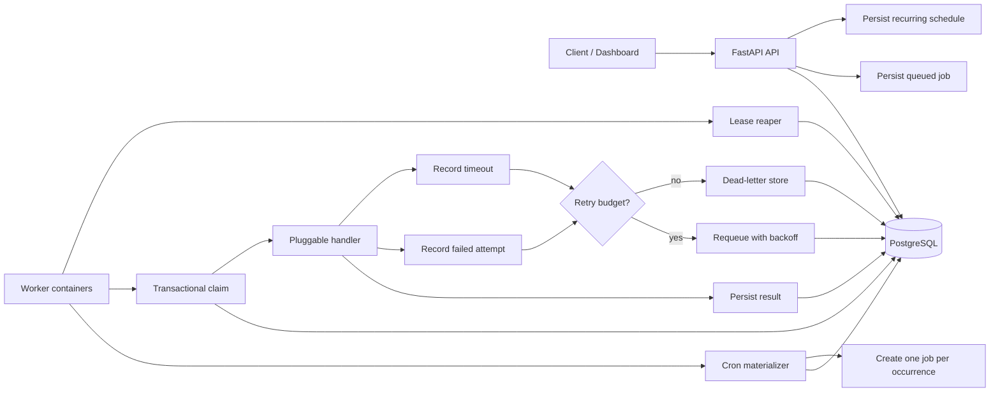

# PulseQueue One-Page Design

## Objective

PulseQueue is a production-oriented asynchronous job processing service. The REST API persists a submission and returns a job ID immediately. Independently scalable workers execute jobs with priority, per-attempt timeout, bounded retries, exponential backoff, dead-lettering, delayed execution, and cron-based recurrence.

The implementation uses Python, FastAPI, PostgreSQL in production, SQLite for low-friction local development, and pytest for unit and integration coverage.

## Architecture

## Core Data Model

- `jobs`: lifecycle state, payload/result, effective retry and timeout configuration, priority, earliest execution time, lease ownership, idempotency key, and recurring occurrence metadata.
- `job_attempts`: immutable execution history with a unique `(job_id, attempt_no)` constraint.
- `dead_letters`: final failure record for jobs that exhaust their retry budget.
- `recurring_schedules`: cron templates, payload/configuration, enabled state, and next/last occurrence timestamps.

The complete schema is documented in [database-schema.md](database-schema.md).

## API Surface

- `POST /jobs`: submit an immediate or delayed job. Supports `Idempotency-Key`.
- `GET /jobs/{job_id}`: inspect lifecycle state, result, attempts, and errors.
- `GET /scheduled-jobs`: list future queued jobs.
- `POST /schedules`: create a UTC cron schedule.
- `GET /schedules`: list recurring definitions.
- `PATCH /schedules/{id}`: pause or resume a schedule.
- `DELETE /schedules/{id}`: delete a schedule definition.
- `GET /queue/depth`: report lifecycle counts, due queued jobs, and future queued jobs.
- `POST /jobs/{job_id}/cancel` and `POST /queue/drain`: operational controls.
- `GET /dead-letters`, `GET /metrics`, `GET/PATCH /config`, and `GET /health`.

## Delivery Semantics

Accepted jobs are persisted before `202 Accepted`. PostgreSQL workers use `FOR UPDATE SKIP LOCKED` to claim different jobs concurrently. A claimed job records `locked_by` and `locked_at`.

If a worker disappears, the lease reaper identifies jobs that exceed `timeout_seconds + lease_grace`, records an `abandoned` attempt, and atomically requeues or dead-letters them. Completion writes are fenced by current lease ownership, so an expired worker cannot overwrite a replacement attempt.

This provides at-least-once delivery, not exactly-once side effects. A handler can produce an external side effect and crash before saving success. Handlers must use the job ID as a downstream idempotency key or use a transactional inbox/outbox pattern.

## Scheduling Semantics

`run_at` implements delayed execution: workers only claim queued jobs where `run_at <= now`.

Recurring schedules are evaluated in UTC. A scheduler embedded in every worker atomically locks due schedule definitions and creates ordinary jobs. Each generated job stores `schedule_id` and `scheduled_for`; a unique index prevents duplicate materialization for the same occurrence.

The current catch-up policy materializes missed occurrences gradually, bounded by the scheduler batch and polling interval. A production platform should make misfire behavior explicit per schedule: skip, fire once, or replay all.

## Observability and Operations

The metrics endpoint reports queue depth, due versus future queued jobs, worker utilization, oldest queued age, latency p50/p95, dead-letter rate, pressure, and suggested in-process concurrency.

The built-in dashboard supports load generation, runtime configuration, delayed submission, recurring schedule management, and metric trends. Dashboard concurrency controls affect threads inside one process; DigitalOcean container count remains a deployment-platform concern.

## Scaling

API and worker components are deployed separately and share PostgreSQL. Worker containers scale independently. Queue depth and oldest queued age are better worker scaling signals than HTTP request rate.

A future autoscaler should use a single control loop with hysteresis, cooldown, minimum/maximum bounds, and a PostgreSQL advisory-lock leader. It should update DigitalOcean worker `instance_count`; it must not compete with a second platform autoscaler controlling the same value.

## Quality Strategy

Tests cover handler behavior, API validation, status transitions, retries, timeouts, DLQ, idempotency, delayed jobs, cron materialization, lease recovery, fencing, and PostgreSQL concurrency. GitHub Actions runs the full suite against PostgreSQL 17, enforces branch-aware coverage, and builds the production Docker image.
