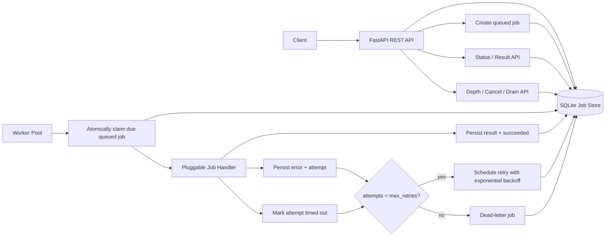

# Async Job Processing Pipeline Service - One Pager Design

## 目标

在 3 小时内实现一个生产感足够强的异步任务处理 REST API。API 接收任务后立即返回 `job_id`，后台 worker 独立拉取并执行任务，支持优先级、重试、单次执行超时、状态查询、结果查询、队列深度、取消/清空待处理任务，以及失败超过上限后的 dead-letter 记录。

推荐技术栈：Python + FastAPI + SQLite + pytest。

选择 Python 的原因：

- 你更熟悉 Python，面试中速度和正确性优先。
- FastAPI 可以快速给出清晰的 REST API、Pydantic schema 和 OpenAPI 文档。
- SQLite 适合单机面试项目，能持久化 job、attempt、dead-letter，并通过事务模拟可靠队列。
- pytest + httpx/TestClient 容易覆盖 API、worker、retry、timeout、dead-letter 等行为。
- 后续如果要上 DigitalOcean，可以用 Docker Compose 把 API 和 worker 分成两个进程，展示 worker 独立扩缩容。

TypeScript/Node.js 也可行，尤其适合用 BullMQ + Redis 做成熟队列；但需要引入 Redis、队列库和更多配置。对于 3 小时 interview，Python/FastAPI + SQLite 的可控性更高。

## 配置策略

Retry 和 timeout 同时支持全局默认值和 per-job override：

- 全局默认值来自环境变量，例如 `DEFAULT_MAX_RETRIES`, `DEFAULT_TIMEOUT_SECONDS`, `MAX_TIMEOUT_SECONDS`, `WORKER_CONCURRENCY`, `BACKOFF_BASE_SECONDS`。
- `POST /jobs` 可以传入 `max_retries` 和 `timeout_seconds`，不传则使用全局默认值。
- API 层校验边界，例如 `max_retries` 不能为负数，`timeout_seconds` 不能超过 `MAX_TIMEOUT_SECONDS`。
- Worker 不读取请求上下文，只读取数据库里已经持久化的 job 配置，保证重启后语义不变。
- 测试可以把 backoff 配成很短，避免 retry 测试变慢。

## 非目标

- 不实现真正分布式锁或多节点强一致调度。
- 不实现 cron recurring jobs，除非核心功能提前完成。
- 不依赖外部托管服务；本地可运行、可测试、可解释优先。

## 架构

## 核心数据模型

`jobs` 表保存任务主记录：

- `id`: UUID
- `status`: `queued | running | succeeded | failed | dead_lettered | cancelled`
- `payload`: JSON
- `result`: JSON，可为空
- `priority`: 数字越大优先级越高
- `max_retries`: 最大重试次数
- `timeout_seconds`: 单次 attempt 超时
- `attempt_count`: 已执行次数
- `last_error`: 最近一次错误
- `run_at`: 最早可执行时间，用于 backoff 和 delayed execution
- `locked_by`, `locked_at`: worker claim 信息
- `created_at`, `updated_at`, `finished_at`

`job_attempts` 表保存每次执行记录，便于 debugging 和测试：

- `job_id`, `attempt_no`, `started_at`, `finished_at`
- `status`: `succeeded | failed | timed_out`
- `error`

`dead_letters` 表保存最终失败任务：

- `job_id`, `payload`, `last_error`, `attempt_count`, `dead_lettered_at`

## API 草案

- `POST /jobs`
  - 输入：`payload`, `priority`, `max_retries`, `timeout_seconds`, 可选 `run_at`
  - 输出：`job_id`, `status`
- `GET /jobs/{job_id}`
  - 输出：状态、attempt 数、last_error、result、时间戳
- `GET /queue/depth`
  - 输出：待执行数量，可按状态拆分
- `POST /jobs/{job_id}/cancel`
  - 只取消 `queued` 或尚未 claim 的任务
- `POST /queue/drain`
  - 取消所有 pending/queued 任务，保留运行中任务
- `GET /dead-letters`
  - 输出 dead-letter 列表，方便验收
- `GET /health`
  - CI 和部署探针使用

## Worker 行为

Worker 循环执行：

1. 用事务从 `jobs` 中 claim 一个 `status = queued` 且 `run_at <= now` 的任务。
2. 排序规则：`priority DESC, run_at ASC, created_at ASC`。
3. 将任务状态改为 `running`，写入 `locked_by/locked_at`。
4. 调用 pluggable handler。初始 handler 可根据 payload 模拟：
   - `{"action": "echo"}` 返回 payload。
   - `{"action": "fail", "failures_before_success": 2}` 用于测试 retry。
   - `{"action": "sleep", "seconds": 5}` 用于测试 timeout。
5. 成功则写入 `result` 并置为 `succeeded`。
6. 失败或超时则写入 attempt 和 `last_error`。
7. 如果还能重试，状态回到 `queued`，`run_at = now + backoff`。
8. 如果超过最大重试，状态置为 `dead_lettered`，写入 `dead_letters`。

Backoff 建议：`min(2 ** (attempt_count - 1), 30)` 秒，测试中允许配置为很短的时间。

## At-Least-Once 语义

系统通过持久化 claim lease 和 stale-job recovery 提供 at-least-once：

- 任务提交和持久化在 HTTP 返回前完成，因此已返回的 `job_id` 不会只存在内存里。
- Worker claim 使用数据库事务；Postgres 使用 `FOR UPDATE SKIP LOCKED`，防止多个 worker 同时获得同一 queued job。
- Worker claim 时写入 `locked_by/locked_at`。当运行时间超过 attempt timeout 加 lease grace，reaper 会把该 attempt 记录为 `abandoned`，并重新入队或在重试耗尽后进入 DLQ。
- Worker 完成时通过 `status=running AND locked_by=current_worker` 条件更新做 fencing；过期 Worker 的迟到结果不能覆盖 replacement attempt。
- 因为崩溃可能发生在 handler 已产生副作用、但结果尚未持久化之前，所以系统语义是 at-least-once，不是 exactly-once。
- 重复执行通过唯一 `(job_id, attempt_no)`、attempt log、lease fencing 和 `max_retries` 限制并可观测。
- Handler 应把 `job_id` 作为外部副作用的 idempotency key，或使用 transactional inbox/outbox。

API 提交支持 `Idempotency-Key` header。相同 key 与相同有效请求返回原 job；相同 key 与不同请求返回 `409 Conflict`。数据库唯一索引保证多个 API 实例并发提交时也只创建一个 job。

## 测试策略

单元测试：

- job 创建默认值和参数校验。
- 状态转换是否合法。
- backoff 计算。
- handler 成功、失败、超时。

集成测试：

- `POST /jobs` 立即返回，worker 后台完成后 `GET /jobs/{id}` 返回 `succeeded` 和 result。
- transient failure 在 max retries 内成功。
- 超过 max retries 后进入 `dead_lettered`，并出现在 dead-letter store。
- timeout 会计入 attempt 并触发 retry/dead-letter。
- priority 高的 job 先被 claim。
- cancel queued job 后不会执行。
- drain pending queue 后 queue depth 归零。

CI：

- GitHub Actions 使用 Python 版本矩阵中的一个稳定版本，比如 3.12。
- 步骤：install dependencies, run formatting/lint if available, run pytest。

## 高负载说明

README 中需要明确：

- API tier 和 worker tier 分离，worker 可以水平扩容。
- SQLite 是面试项目选择；生产环境应换成 Postgres + Redis/RabbitMQ/SQS 之一。
- 指标：queue depth、claim rate、success/failure rate、dead-letter rate、worker utilization、job latency p50/p95。
- 背压策略：限制 payload 大小、限制每用户提交速率、设置最大 queue depth、对低优先级任务降级。

## Observability

MVP 中用结构化 JSON metrics endpoint 实现可验收的 observability：

- `GET /metrics` 返回应用级指标 JSON，便于测试和 demo。
- `queue_depth`: 当前 `queued` 且 due/pending 的任务数量，也可以按 status 分组。
- `worker_utilization`: `busy_workers / configured_worker_concurrency`；单进程 MVP 可用 worker loop 内的 busy counter 统计。
- `job_latency_p50` 和 `job_latency_p95`: 从 `created_at` 到 `finished_at` 的耗时分位数。
- `dead_letter_rate`: 最近窗口内 dead-letter 数 / 完成任务数，MVP 可先提供累计值和计算窗口说明。

生产演进：

- 用 OpenTelemetry 或 Prometheus client 暴露 `/metrics`。
- Grafana 画 queue depth、latency、worker utilization、dead-letter rate。
- 告警规则：queue depth 持续升高、p95 latency 超阈值、dead-letter rate 超阈值、worker utilization 长时间接近 100%。

## Operator Dashboard

为了让面试 demo 更直观，提供一个轻量 operator dashboard：

- `GET /dashboard` 返回一个内置 HTML 页面，不需要 React build pipeline 或外部 Grafana 账号。
- 页面轮询 `GET /metrics` 和 `GET /queue/depth`，展示 queue depth、running jobs、succeeded/failed/dead-lettered、worker utilization、latency p50/p95。
- 配置区允许调整默认 `max_retries`, `timeout_seconds`, `worker_concurrency`, `backoff_base_seconds`，通过 `GET /config` 和 `PATCH /config` 管理运行时配置。
- Load test 区提供按钮生成大量测试 jobs，例如 100/500/1000 个 echo 或 flaky jobs，用于观察 queue depth 上升、worker busy、latency 变化和 dead-letter 增长。
- Worker scaling 区展示当前 worker concurrency、建议 concurrency，以及手动调整按钮。MVP 可以在本地进程内调整 worker pool 大小；生产部署时再映射到 DigitalOcean worker component 的 container 数量。

关于 autoscaling 的诚实边界：

- 本地 demo 可以实现 adaptive worker pool：当 queue depth 或 oldest queued age 超过阈值时，提高进程内 worker concurrency；下降后缩回。
- DigitalOcean App Platform 的真实 worker container 扩容需要平台 autoscaling 或 DigitalOcean API token。没有 token 时，dashboard 只能展示扩容建议和本地 worker concurrency 调整。
- 如果配置了 `DIGITALOCEAN_ACCESS_TOKEN` 和 app/component id，可以作为 next step 增加一个受保护的 scale endpoint 调用 DigitalOcean API 调整 worker component container 数量。

## Deployment 和 Autoscaling

本项目自身不直接“检测流量然后自动扩容机器”；它负责暴露指标和健康检查，扩容由部署平台或外部控制器执行。

- DigitalOcean App Platform 可以把 API 和 worker 作为独立组件部署，worker component 可以独立调整 container 数量。
- App Platform 官方支持按固定 container 数扩容，也支持 CPU-based autoscaling；service component 还支持 request-based autoscaling 的 public preview。
- 对 worker 来说，最关键指标不是 HTTP request rate，而是 queue depth、oldest queued age、worker utilization。生产版可以用这些指标驱动扩容策略。
- 面试 MVP 可以实现 `/metrics` 和 README 中的扩容说明；如果时间充足，再加 `.do/app.yaml` 作为部署样例。

部署到 DigitalOcean 通常需要：

- DigitalOcean personal access token，用于 `doctl auth init` 或 GitHub Actions secret，例如 `DIGITALOCEAN_ACCESS_TOKEN`。
- GitHub repo 权限，用于 App Platform 从仓库拉代码，或 GitHub Actions 触发部署。
- 如果使用 Container Registry，需要 registry 权限。
- 如果使用 Managed Postgres/Redis，需要数据库连接串作为 App Platform environment variable。

这些 key 通常不会由题目自动提供；需要面试环境允许你登录自己的 DigitalOcean/GitHub 账号，或者只提交代码和部署说明。

## 可选扩展顺序

1. Dockerfile + docker-compose，把 API 和 worker 分开启动。
2. `run_at` delayed execution。
3. lease reaper，恢复卡在 running 的任务。
4. 内置 operator dashboard，支持 load test 和 runtime config。
5. Prometheus 风格 `/metrics`。
6. DigitalOcean App Platform 或 Droplet 部署说明。
